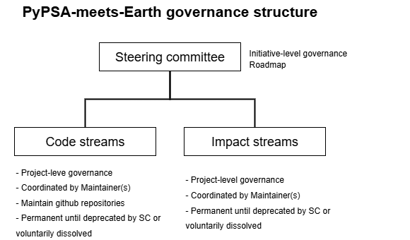

# PyPSA-meets-Earth Governance

This document defines the governance structure for the PyPSA-meets-Earth initiative, inspired by the Flyte project.

## Overview

PyPSA-meets-Earth is a collaborative open source initiative dedicated to building a transparent, inclusive, and reproducible energy system modeling ecosystem, leveraging the PyPSA framework and contributing to the broader scientific and policy discourse around sustainable transitions. This document outlines how the community collaborates and governs to achieve these goals.

## Streams

To support the diverse activities within PyPSA-meets-Earth, the community is organized into Streams. These are focused areas of collaboration that help structure contributions and foster deeper engagement. Each Stream is coordinated by at least one Stream Coordinator, who facilitates collaboration, supports contributors, and ensures alignment with community goals. Coordinators are typically active Contributors with domain expertise. Streams can be:
- Code streams (e.g. PyPSA-Earth) or
- Impact streams (e.g. Outreach).

### Examples of Streams

Here are a few illustrative examples of existing Streams:

| Stream Name     | Focus Area                          | Example Activities                          |
|-----------------|-------------------------------------|---------------------------------------------|
| PyPSA-Earth     | Global energy system modeling       | Data integration, new features         |
| Outreach        | Community growth and engagement     | Events, social media, onboarding            |
| PyPSA-Distribution | Small-scale multi-energy modeling | High-resolution modeling, off-grid optimization |

A full and up-to-date list of Streams is maintained on the [PyPSA-meets-Earth website](https://pypsa-meets-earth.github.io).

## Decision Making: Lazy Consensus

Most decisions in PyPSA-meets-Earth are made using **lazy consensus**: if no one objects within a reasonable period (typically 5-7 days), the proposal is accepted. Only in rare cases where consensus cannot be reached, a more formal vote may be called (see "Supermajority" below).

## Community Roles

Roles apply equally to code and non-code activities (e.g., documentation, community, tools, streams). The following table lists the roles within the PyPSA-meets-Earth community, describing:

- General responsibilities expected by individuals in each role
- Requirements necessary to join or remain in a role
- Associated access rights

<table>
  <thead>
    <tr>
      <th>Role</th>
      <th>Responsibilities</th>
      <th>Requirements</th>
      <th>Access Rights</th>
      <th>Scope</th>
    </tr>
  </thead>
  <tbody>
    <tr>
      <td>Participant</td>
      <td>
        <ul>
          <li>Follow the <a href="https://lfprojects.org/policies/code-of-conduct/">Code of Conduct</a></li>
          <li>Join and interact on initiatives' platforms, including Discord and Github</li>
        </ul>
      </td>
      <td>None</td>
      <td>
        <ul>
          <li>Can submit PRs and issues from forks</li>
          <li>Can join the PyPSA-meets-Earth Discord channel (<a href="https://discord.gg/AnuJBk23FU">join here</a>)</li>
          <li>Can take part in community discussions</li>
        </ul>
      </td>
      <td>GitHub organization</td>
    </tr>
    <tr><td colspan="5"><em>Inherits from Participant</em></td></tr>
    <tr>
      <td>Contributor</td>
      <td>
        <ul>
          <li>Report and help resolve issues</li>
          <li>Answer community questions</li>
          <li>Review and provide feedback on issues/PRs</li>
          <li>Contribute to code, documentation, tools, or community streams</li>
        </ul>
      </td>
      <td>
        <ul>
          <li>Active participation (e.g., merged contribution, regular discussion, or content creation)</li>
        </ul>
      </td>
      <td>
        <ul>
          <li>Can review PRs</li>
          <li>May close/open/reassign issues</li>
          <li>May request PR reviews</li>
          <li>Can mark duplicates</li>
        </ul>
      </td>
      <td>Specific repo(s) or streams under pypsa-meets-earth</td>
    </tr>
    <tr><td colspan="5"><em>Inherits from Contributor</em></td></tr>
    <tr>
      <td>Coordinator (Maintainer)</td>
      <td>
        <ul>
          <li>Guide project direction and quality</li>
          <li>Help cut releases</li>
          <li>Mentor contributors</li>
          <li>Review and merge PRs</li>
          <li>Coordinate with other streams (e.g. PyPSA-Earth, Outreach, etc.)</li>
          <li>Actively engages in users support</li>
        </ul>
      </td>
      <td>
        <ul>
          <li>Consistent, high-quality contributions</li>
          <li>Broad project knowledge</li>
        </ul>
      </td>
      <td>
        <ul>
          <li>Approve and merge PRs</li>
          <li>Manage releases</li>
          <li>Moderate discussions</li>
          <li>Vote on major decisions (if needed)</li>
          <li>Access rights to fulfill the goal of the stream/package
        </ul>
      </td>
      <td>Specific repo(s) or streams under pypsa-meets-earth</td>
    </tr>
    <tr><td colspan="5"><em>Inherits from Coordinator</em></td></tr>
    <tr>
      <td>Steering Committee</td>
      <td>
        <ul>
          <li>Set roadmap/priorities</li>
          <li>Mentor contributors/Coordinators</li>
          <li>Vote on governance, roles, (if consensus fails)</li>
        </ul>
      </td>
      <td>
        <ul>
          <li>Must be a Coordinator</li>
          <li>Highly active in multiple areas</li>
        </ul>
      </td>
      <td>
        <ul>
          <li>Org-wide access rights</li>
        </ul>
      </td>
      <td>GitHub organization</td>
    </tr>
  </tbody>
</table>

## Role Description and Processes

### Participant

Anyone can contribute by using PyPSA-meets-Earth tools, providing feedback, joining discussions, submitting issues and PRs, or helping others.

### Contributor

Contributors actively engage with the community and support others across all streams (code, docs, tools, community).

#### Becoming a Contributor

- Participate actively (e.g., merged PR, regular discussion, or content creation).
- Recognition is informal and based on ongoing participation.

### Coordinator (Maintainer)

Coordinators manage daily project contributions, review PRs, and ensure quality across all streams.

#### Nomination Process

1. Open an issue in the community repo using the `coordinator-nomination` label.
2. Assign current Coordinators as reviewers.
3. Approval is by lazy consensus (if no objections in 7 days, nomination is accepted).
4. If consensus cannot be reached, a supermajority vote of Coordinators may be called.

#### Removal or Resignation

Coordinators may step down voluntarily or be removed by lazy consensus (or supermajority vote if needed) due to inactivity or other circumstances.

### Steering Committee

Responsible for strategic direction, cross-repo/stream concerns, and governance decisions. Duties include:

- Reviewing proposals for new sub-projects or streams
- Establishing Streams
- Approving governance and role changes

## Stepping Down / Emeritus Process

Contributors can step down to a lower role or request emeritus status by contacting the Coordinators.

---

**NOTE:** The current list of Coordinators and Steering Committee members is maintained in [COORDINATORS](COORDINATORS.md).

## Definitions

### Lazy Consensus

A decision-making process where a proposal is accepted if no one objects within a set period (usually 5-7 days). Objections should be accompanied by reasoning and, ideally, alternatives.

### Supermajority

A supermajority is defined as two-thirds of members in the group (66%). Used only if lazy consensus fails. Voting can happen on the mailing list, GitHub, Discord, email, or via a voting service, when appropriate. Members can either vote "agree, yes, +1", "disagree, no, -1", or "abstain". A vote passes when supermajority is met. An abstain vote equals not voting at all.

